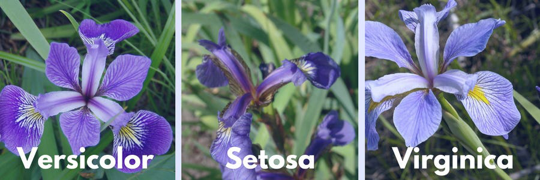

# iris-flower-classification

Iris Flower Classification web app using Machine Learning and Streamlit
---

## Project Overview

This project predicts the species of an Iris flower (Setosa, Versicolor, or Virginica) based on user-provided features such as:
- Sepal Length (cm)
- Sepal Width (cm)
- Petal Length (cm)
- Petal Width (cm)

The model is trained on the famous **Iris dataset** and deployed as an interactive **Streamlit web application**.

---

## Key Features

- **Logistic Regression classifier**
- **Clean web-based user interface via Streamlit**
- **User-friendly sliders to provide input features**
- **Displays predicted Iris species immediately**

---

## Files in this Repository

| File / Folder | Description |
|--------------|-------------|
| `iris_dataset.ipynb` | Jupyter notebook for data preprocessing, model training, and evaluation |
| `app.py` | Streamlit application code for the web interface |
| `iris_dataset.pkl` | Serialized (pickled) logistic regression model |
| `Iris.csv` | Dataset file (Iris dataset) |
| `IRIS.png` | Image used in the Streamlit web app |

---
